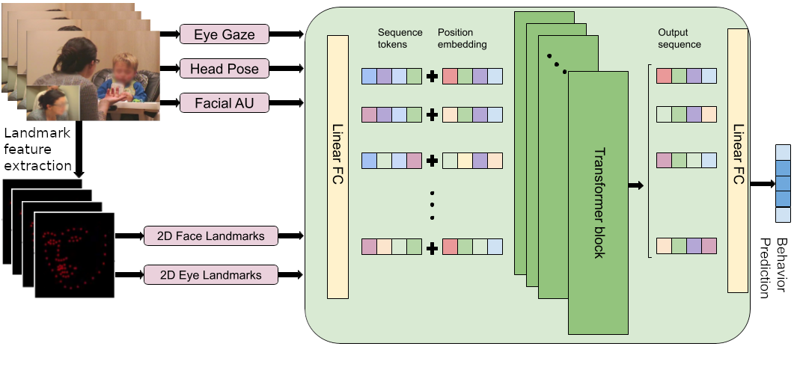

# Autism Spectrum Disorder related Behavior Detection from Videos of Infant Interaction

## Multi-head self-attention based Transformer model architecture



## Getting Started

Instructions on project setup and running training and inference.

### Installation

1.  **Get the code:** Clone this repository and `cd` into it.
2.  **Create a Conda environment (recommended):**
    ```bash
    conda create -n your_env_name python=3.x
    ```
    Our current python version is 3.8.19
    ```
    conda activate your_env_name
    ```
3.  **Install dependencies:**
    ```bash
    pip install -r requirements.txt 
    ```

### Data

This code operates on precomputed per-session features (facial landmarks, eye landmarks,
head pose, gaze, action units, and I3D RGB/flow features) rather than raw video. Before
running training or inference, set the paths in `config/default.yaml` to point at your
local copy of the released feature set. The expected layout is:

```
<ASD_FEATURES_ROOT>/
  features/parquet_files/<session>.parquet
  features/i3dfeatures/frame16/rgb/<session>.npy
  features/i3dfeatures/frame16/flow/<session>.npy
  data_splits/standard_filenames/fold{0..4}/<split>_fold{N}[_subfold{M}].txt
  data_splits/nonstandard_filenames/fold{0..4}/<split>_fold{N}[_subfold{M}].txt
  checkpoint/   finalmodel/   predictions/   metrics/   video_out/
```

The accompanying dataset release provides the feature files and split lists.

### Configuration

The project's default settings are managed through `config/default.yaml` located in the `config/` directory.

### Running the Code

The `main.py` script serves as the entry point. You can specify the primary action (`--run`) and override any YAML configuration parameter directly from the command line using a dot-notation (e.g., `--data.behavior`).

#### Basic Usage:

To run with default settings (as defined in `config/default.yaml`):

### Inference on pre-trained models
```
python main.py --run inference --data.behavior [BEHAVIOR_NAME]
```


### Training a behavior model from scratch
```
python main.py --run train --data.behavior [BEHAVIOR_NAME] --training.num_epochs [INT_NUMBER]
```

### Available behaviors for data.behavior:

- look_face: Detects instances of subject looking at a face.

- look_object: Detects instances of subject looking at an object.

- smile: Detects instances of smiling.

- vocal: Detects instances of vocalizations.


